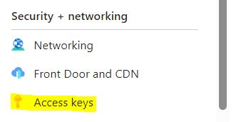

# Easier read & write access to files and tables stored in Azure Data Lake Storage (ADLS)

* Author: KBO@mbshipbrokers.com
* Last meaningful update: 31-07-2025

This repository contains Python functions that enable easier read & write access to files stored in Azure Data Lake Storage (ADLS) blobs as well as ADLS tables. The code is structured in such a way that enables installing the repo as a standalone package, which makes it easier to plug and use in other projects.

## Functionalities

Includes the following functionalities:

### General

- Easy connection to Azure blob/table storage using connection string from a local `.env` file

### Azure blob storaage

- Import data frames from Azure blob storage (supported formats: .csv, .xlsx, .xls, .xlsm, .hdf, .gbq, .f, .feather, .parquet)
- Import certain file objects from Azure blob storage (supported formats: .txt, .pkl, .pickle, .json)
- Write data frames to Azure blob storage
- Append or delete rows from a data frame file stored on Azure blob storage

### Azure data tables

- Check whether a given Azure data table already exists
- Create a new Azure data table
- Query an existing Azure data table to load data from it
- Write data to an Azure data table, including the ability to add partition keys to the table
- Rename and delete Azure data tables/columns in Azure data tables
- Perform delete and write operations in batches, thereby increasing the speed of the operations

## Requirements

### Python

The functions contained in this repository were tested under both Python 3.11 and Python 3.12 and confirmed to be working under both. To find a complete list of the package's dependencies, please refer to the `pyproject.toml` file.

For running the examples shown in the `examples.py` script, you will also need a local `.env` file that contains an access code for Azure (read the next section for more info on how to obtain and store said access key). An `.env.example` file has been included, showing the format of the access key expected by this package.

### Azure storage account

Regarding the Azure set-up, the functions used in here require the use of a `connection_string`, which must be enabled in the Azure UI (left sidebar -> "Security + networking" -> "Access keys"):



Once this has been enabled, the connection string can be saved to the `.env` file in the main folder which would have the following format:

```
DefaultEndpointsProtocol=??????;AccountName=??????;
AccountKey=??????;EndpointSuffix=core.windows.net
```

The `get_access()` function handles the import of the access key and returns the connection string that can then be passed on to the `read_blob()` and `write_blob()` functions (or a `TableService` when connecting to Azure tables).

## Working with Azure blob storage

### Functions and scripts

The functions for working with blob storage are contained in the `files.py` script, while the functions for working with Azure tables in the `tables.py` script. The `access.py` script contains a single function that facilitates setting up access to either Azure blob storage or Azure tables.
 
To see some examples of how these functions can be used to access data are given in the `examples.py` script.

### General logic

Both the `read_blob()` and `write_blob()` functions work in a similar way and rely on other (native Python/pandas/json/pickle) functions to work. Their main role is to automate the process by auto detecting the file format from the file extension and then calling on the right function to "do the actual job".

In the process of reading/writing data, either encoding and/or conversion to an IO bytes object is used. This is done in order to avoid having to create temporary local files.

In either case, both functions support `**kwargs` that will be passed on to `pandas` function.

### Supported file types

Both `read_blob()` and `write_blob()` support the following file formats:

#### General files

* .pkl/.pickle: support for all pickled objects
* .json
* .txt

#### Data frames

* .csv
* .xlsx/.xls/.xlsm
* .pkl/.pickle
* .html
* .hdf (not tested)
* .stata
* .gbq (not tested)
* .parquet
* .feather/.f

If you try to read or write a file from/to an unsupported file format, you will get a `ValueError`.

### Operations available

* Reading existing files in blob storage (the `read_blob()` function)
* Writing new/overwriting existing files in blob storage (the `write_blob()` function)
* Appending rows to existing files containing tabular data (the `append_to_blob()` function)
* Filtering the data in an existing blob either by one or multiple variables who should have one or more "acceptable values" (the `filter_blob()` function); this could be useful to do a clean-up in case we've been appending new data to an existing file for quite some time
* Deleting files and/or directories, if they already exist in the specified container (the `delete_blob_if_exists()` function)

## Working with Azure tables

### General logic

Azure tables are database-like but without the added complexity of schemas and relationships. The functions in here allow for creating, deleting and renaming tables as well as for retrieving, inserting or deleting rows.

Upon insertion of new rows, Azure will automatically add a timestamp, though the user can also choose to supply a timestamp for the added rows by supplying a `PartitionKey` through the `add_keys_to_df()` function.

**Please note** that `PartitionKey` and `RowKey` must both be strings. This is a requirement for Azure tables.

### Working with tables

Tables can be created or deleted using the provided functions:

* To check whether a table exists, use the `table_exists()` function
* To create a new table (assuming it doesn't already exist), use the `create_table()` function

Renaming is not currently implemented (and actually not technically possible in Azure).

### Working with rows

Rows can be retrieved, deleted or inserted by using the provided functions.

<u>Retrieval can be done in either of the following ways:</u>

* **Get all rows or a subset of rows**: to retrieve all rows or a subset of rows, use the `query_entities()` function
* **Get specific row only**: to retrieve one specific row with a known `PartitionKey` and `RowKey`, use the `query_entity()` function 

<u>Deletion and insertion can be performed either:</u>

* **On a one-by-one basis**: recommended for small tables only due to slow performance on large tables (use the `delete_all_rows()` and `write_df_to_azure_table()` functions)
* **On a per-batch**: recommended for larger tables; uses batches of up to 100 entities (the maximum supported by ADLS) - the user does not have to be concerned about providing batch sizes (use the `delete_all_rows_batch()` and `write_df_to_azure_table_batch()` functions)

## Features not yet implemented

The following are not currently implemented as their own functions but could be useful to have:

### Azure blobs

* list all files and/or folders in a particular blob
* delete file from blob
* move file within blob or between blobs
* rename file in blob